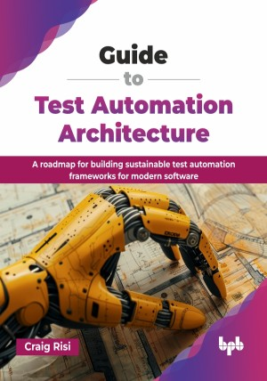

# Guide to Test Automation Architecture

A roadmap for building sustainable test automation frameworks for modern software.

This is the repository for [Guide to Test Automation Architecture
](https://bpbonline.com/products/guide-to-test-automation-architecture?_pos=1&_sid=7754f0be8&_ss=r&variant=44745918251208?variant=44745918251208),published by BPB Publications.

## About the Book
In the software development domain, test automation has emerged as the cornerstone of delivering reliable applications. This comprehensive guide provides a systematic roadmap for designing and implementing test automation frameworks that transcend tool-specific limitations, ensuring they adapt and endure.

You will learn to apply core software architectural principles—including modularity, loose coupling, and layering—to your test code. The book offers practical guidance on managing test data, orchestrating parallel test executions, and integrating seamlessly with CI/CD pipelines using quality gates. Furthermore, it details how to expand your framework's capabilities to include non-functional testing, such as security, performance, and resilience.

Through detailed case studies, you will gain a clear understanding of what it takes to build a scalable framework from scratch, migrate a legacy system, and foster continuous architectural improvement. With insights into emerging trends, like AI-driven automation and predictive analytics, this book is both a toolkit and a strategic guide. It empowers architects, testers, and developers alike to embrace complexity and lead the way in modern test automation.

## What You Will Learn
• Design a scalable, tool-agnostic framework with architectural patterns.

• The role of software architecture in test automation.

• Building a test automation framework that caters to all types of applications

• Integrate testability into software design using dependency injection.

• Embed automated quality gates into CI/CD pipelines.

• Handling modern testing challenges.

• Leverage AI/ML to create self-healing and predictive test suites.
